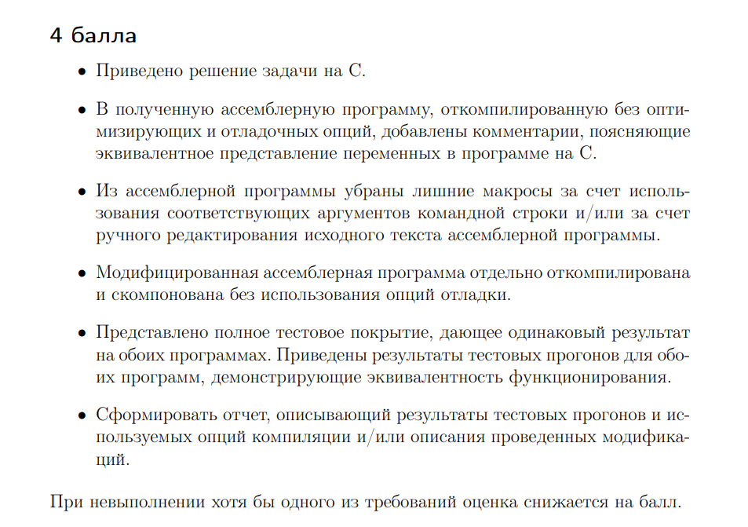
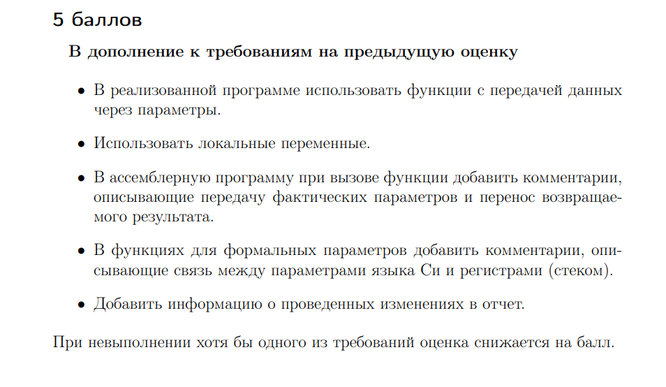

# HW1AVS
Первое идз по АВС
# 4 балла
  > 
## Программа на С++
[Здесь](/4point/max.c)
## Предоставлю сразу отредактированный код
[Здесь](/4point/max.s)

Если вам интересны комментарии:
```sh
MAX_SIZE:                     # максимальная длина массива
    .long 1000                   # значение этой длины
    .local ARRAY_A               # массив считывания
    .comm ARRAY_A,4000,32        # память под этот массив
    .local ARRAY_B               # преобразованный массив
    .comm ARRAY_B,4000,32        # память под этот массив
    .text
    .globl compare               # объявление функции
    .type compare, @function
 ```
 ## Тестирование
 Тесты расположены в данной [директории](tests/tests/).
 
 Результаты тестов сишного кода.
  > 
  
  Результаты тестов ассемблера.
  
  > 
## Компилирование и компановка без использования опции отладки.
Отображено в результатах теста ассемблера, в начале скриншота.
## Вывод.
По результатам тестов мы видим, что и там, и там тесты проходят корректно. Также корректно обрабатываются неккоректные значения.

# 5 баллов 

  > 

## Передача данных через параметры 
Реализована в программе на 4 балла.
## Локальные переменные
Реализованы в программе на 4 балла.
## Два пункта о комментировании.
Можете взглянуть на код [здесь](/5point/max.s)

# 6 баллов
  > 
## Редактирование кода

Заменил -4[rbp] на r13d

Заменил -8[rbp] на r13d

заменил -20[rbp] на r14d

Получил отредактированный [код](/6point/max.s)

## Отчет
  > 
Попытался минимизировать использования стека, заменной на данные регистры.
